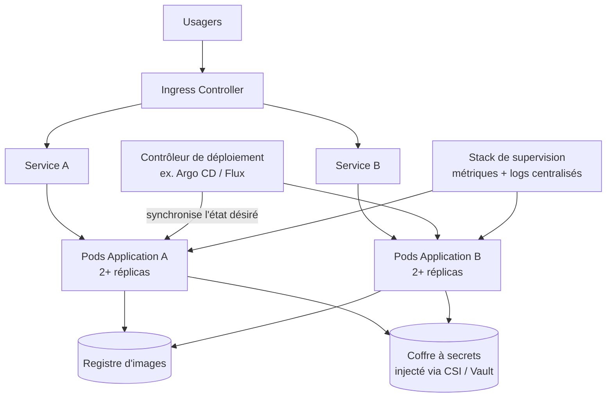

```mermaid
flowchart TB
    User[Usagers] --> Ingress[Ingress Controller]
    Ingress --> SvcA[Service A]
    Ingress --> SvcB[Service B]
    SvcA --> PodsA[Pods Application A<br/>2+ réplicas]
    SvcB --> PodsB[Pods Application B<br/>2+ réplicas]
    PodsA --> Registry[(Registre d'images)]
    PodsB --> Registry
    PodsA --> SecretsStore[(Coffre à secrets<br/>injecté via CSI / Vault)]
    PodsB --> SecretsStore
    Controller[Contrôleur de déploiement<br/>ex. Argo CD / Flux] -->|synchronise l'état désiré| PodsA
    Controller --> PodsB
    Monitoring[Stack de supervision<br/>métriques + logs centralisés] --> PodsA
    Monitoring --> PodsB
```