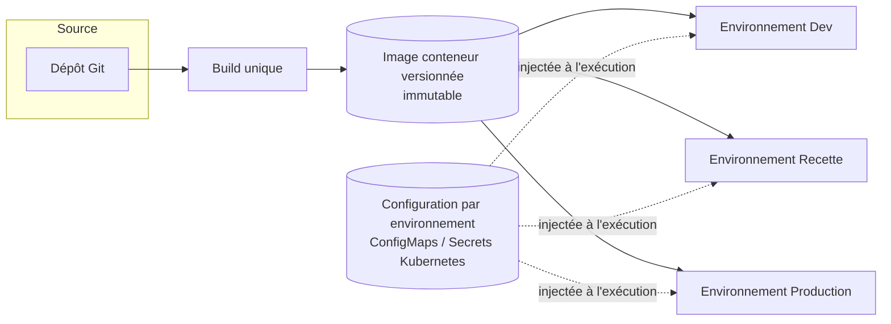

```mermaid
flowchart LR
    subgraph Source
        Git[Dépôt Git]
    end
    Git --> Build[Build unique]
    Build --> Artefact[(Image conteneur versionnée<br/>immutable)]
    Artefact --> Dev[Environnement Dev]
    Artefact --> Recette[Environnement Recette]
    Artefact --> Prod[Environnement Production]
 
    Config[(Configuration par environnement<br/>ConfigMaps / Secrets Kubernetes)] -.injectée à l'exécution.-> Dev
    Config -.injectée à l'exécution.-> Recette
    Config -.injectée à l'exécution.-> Prod
```