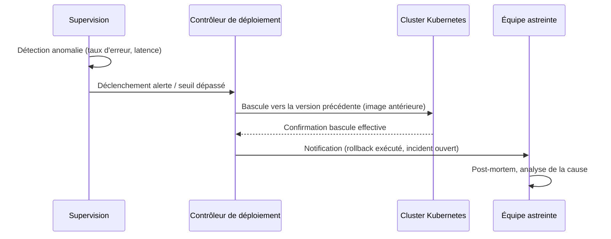

```mermaid
sequenceDiagram
    participant Sup as Supervision
    participant Ctrl as Contrôleur de déploiement
    participant K8s as Cluster Kubernetes
    participant Eq as Équipe astreinte
 
    Sup->>Sup: Détection anomalie (taux d'erreur, latence)
    Sup->>Ctrl: Déclenchement alerte / seuil dépassé
    Ctrl->>K8s: Bascule vers la version précédente (image antérieure)
    K8s-->>Ctrl: Confirmation bascule effective
    Ctrl->>Eq: Notification (rollback exécuté, incident ouvert)
    Eq->>Eq: Post-mortem, analyse de la cause
```