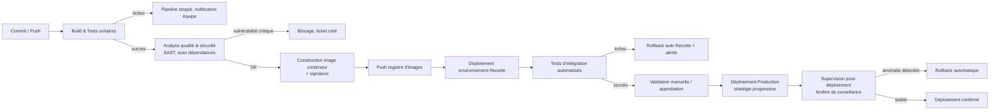

 

```mermaid
flowchart LR
    A[Commit / Push] --> B[Build & Tests unitaires]
    B -->|échec| B1[Pipeline stoppé, notification équipe]
    B -->|succès| C[Analyse qualité & sécurité<br/>SAST, scan dépendances]
    C -->|vulnérabilité critique| C1[Blocage, ticket créé]
    C -->|OK| D[Construction image conteneur<br/>+ signature]
    D --> E[Push registre d'images]
    E --> F[Déploiement environnement Recette]
    F --> G[Tests d'intégration automatisés]
    G -->|échec| G1[Rollback auto Recette + alerte]
    G -->|succès| H[Validation manuelle / approbation]
    H --> I[Déploiement Production<br/>stratégie progressive]
    I --> J[Supervision post-déploiement<br/>fenêtre de surveillance]
    J -->|anomalie détectée| K[Rollback automatique]
    J -->|stable| L[Déploiement confirmé]
```