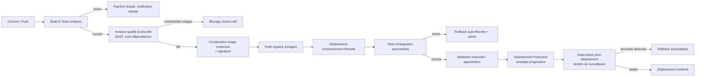
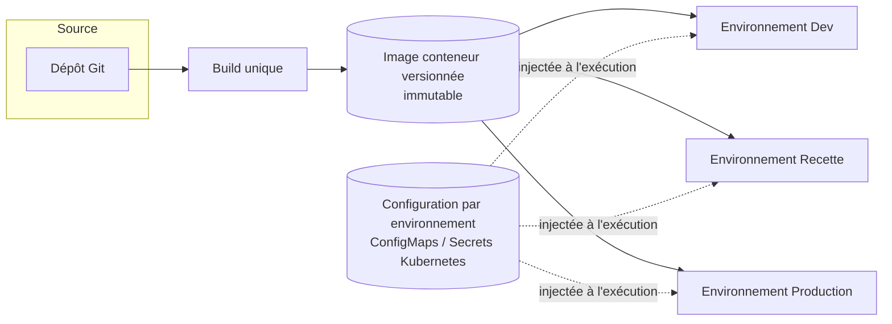
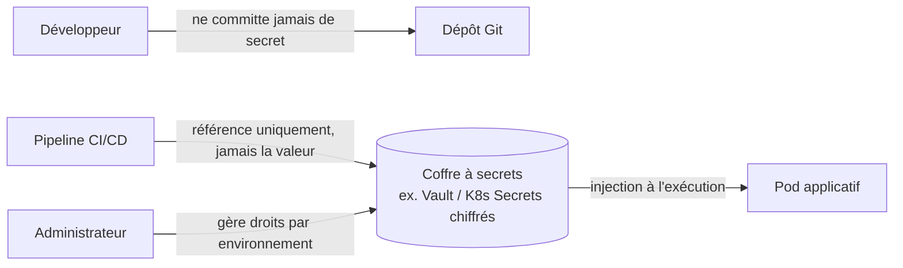
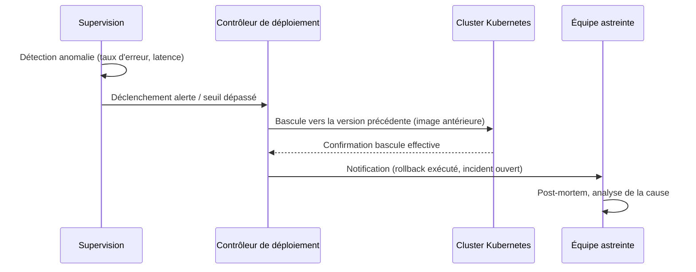
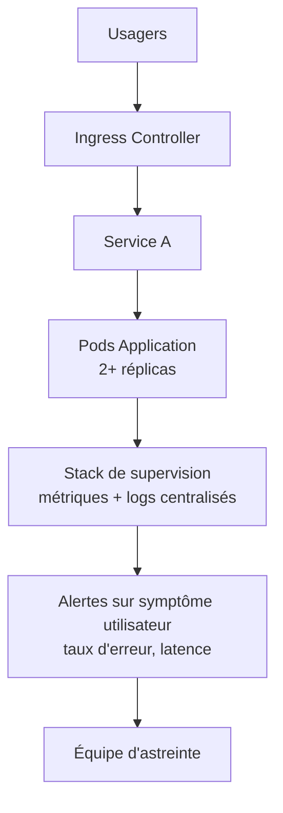

Destinataire : Direction des Systèmes d'Information & Direction de l'Agence
# TACHE : Architecture & Organisation Cible de la chaine CI/CD

## 1. Principes directeurs & Alignement stratégique
Pour atteindre l'objectif de déploiements hebdomadaires sans regressions et garantir un MTTR (Mean Time to recover) rapide, la stratégie DevOps reposera sur les principes suivants :
- **GitOps & Tout sous forme de code** : Application, infrastructure (IaC), configurations et règles de sécurité sont versionnées dans Git.
- **Invariance des Artefacts** : Une image Docker est construite une seule fois en début de pipeline et est promue à travers les environnements.

- **Sécurité Intégrée (Shift Left)** : Contrôles de sécurité automatisés dès la phase de push (SAST, SCA, Secret Scanning, Container Scan).

- **Découplage Déploiement / Activation** : Séparation de la mise en ligne technique et de l'ouverture fonctionnelle (Feature Flags).

## 2. Architecture de la Chaîne CI/CD
### A. Structure du Pipeline CI/CD (Workflow GitLab CI / GitHub Actions)
Vue d'ensemble du pipeline CI/CD incluant toutes les étapes de construction, tests, sécurité et déploiement. Le pipeline est déclenché par un push sur la branche principale (main/master) et suit les étapes suivantes :
 

## 2. Gestion des environnements
Principe retenu : un artefact unique, une configuration distincte par environnement injectée à l'exécution (variables d'environnement, ConfigMaps Kubernetes) plutôt que codée dans l'image. Les manifestes Kubernetes eux-mêmes (déploiements, services) sont versionnés dans Git et appliqués de façon identique aux trois environnements, seules les valeurs de configuration changeron, ce qui traiteras directement les écarts de configuration constatés dans l'énoncé : ils ne peuvent plus apparaître entre deux applications manuelles divergentes, puisque l'application est automatisée et déclarative.

## 3. Contrôles qualité
 
- Tests unitaires automatisés, exécutés à chaque commit, avec un seuil de couverture minimal en dessous duquel le pipeline est bloqué.
- Tests d'intégration en environnement de Recette avant toute validation vers la Production.
- Analyse statique de code (SAST) intégrée au pipeline, pas en revue ponctuelle.
- Revue de code obligatoire avant fusion sur la branche principale, condition d'entrée dans le pipeline plutôt que contrôle a posteriori.
---

## 4. Sécurité
 
- Scan de vulnérabilités des dépendances et de l'image conteneur à chaque construction, avec seuil de blocage assumé (les vulnérabilités critiques exploitables bloquent, les autres sont tracées avec un plan de résorption plutôt que de paralyser toute livraison).
- Image de base maîtrisée et régulièrement mise à jour, plutôt que reconstruite sur une base non contrôlée.
- Signature de l'image lors de sa construction, vérifiée avant déploiement, pour garantir que l'artefact déployé est bien celui qui a traversé le pipeline.
- Traçabilité complète : qui a validé quoi, à quelle étape, sur quelle base — condition pour ouvrir un déploiement automatisé sans perdre le contrôle.
---
 
## 5. Gestion des secrets
 

Aucun secret ne transite par le dépôt Git ni par l'image conteneur : le pipeline référence un identifiant de secret, la valeur elle-même est injectée à l'exécution par un coffre dédié, avec des droits d'accès distincts par environnement (un accès en Recette ne donne pas accès aux secrets de Production).
---
 
## 6. Stratégie de déploiement et rollback
 
- Déploiement progressif en production (par exemple un sous-ensemble d'instances d'abord, extension une fois la stabilité confirmée) plutôt qu'un basculement intégral immédiat — ce qui limite l'exposition en cas de régression non détectée en amont.
- Rollback automatique déclenché par la supervision si une anomalie apparaît dans la fenêtre de surveillance suivant le déploiement :

 
- Condition nécessaire à ce mécanisme : l'image précédente reste disponible dans le registre, et toute modification de schéma de données accompagnant un déploiement est conçue pour rester compatible avec la version antérieure le temps que le rollback reste possible — sans quoi le retour arrière applicatif ne suffit pas à annuler l'incident.
---
 
## 7. Supervision
 

 
- Métriques suivies en priorité : taux d'erreur applicatif et latence perçue par les usager, plutôt que des seuils machine isolés (charge CPU, mémoire) qui ne reflètent pas directement le service rendu.
- Logs centralisés et consultables par les équipes de développement, condition pour diagnostiquer sans dépendre d'une intervention manuelle sur le serveur.
- Fenêtre de surveillance définie après chaque déploiement, pendant laquelle le rollback automatique reste armé.
---