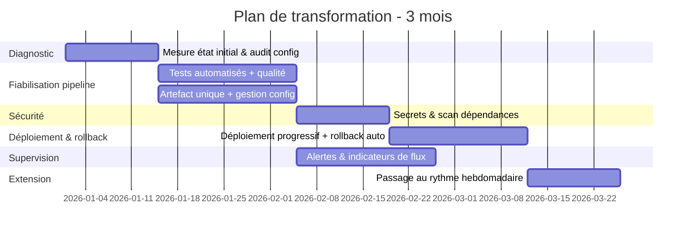

Plan de transformation DevOps — 3 mois
 
## 1. Diagnostic de départ
 
Avant tout changement, on fixe l'état mesuré aujourd'hui — sans ce point de départ chiffré, Il seraaa impossible de prouver un progrès à 3 mois :
 
| Indicateur | État actuel |
|---|---|
| Fréquence de mise en production | Irrégulière, avec interventions manuelles |
| Incidents post-déploiement (2 derniers mois) | 4 |
| Rollbacks nécessaires (2 derniers mois) | 2 |
| Écarts de configuration entre environnements | Constatés, non quantifiés à ce jour |
| Part d'étapes automatisées dans le déploiement | Partielle (Git utilisé, mais mises en production manuelles) |
| Temps de rétablissement après incident | Non mesuré actuellement |

## 2. Proposition de Séquencement

Les deux premières semaines du plan servent aussi à quantifier précisément les deux dernières lignes, qui ne le sont pas encore. Ce séquencement est proposé à titre indicatifs, il pourrait être ajusté en fonction des resultat du diagnostic.

 
**Logique de l'ordre choisi :**
- La fiabilisation du pipeline (tests, artefact unique) précède la sécurité et le déploiement automatisé : automatiser la mise en production d'un code non testé aggraverait le taux d'incidents actuel plutôt que de le réduire.
- La sécurité (secrets, scan de dépendances) est traitée avant l'ouverture du déploiement automatisé en production, car un déploiement plus fréquent sans contrôle de sécurité intégré multiplierait l'exposition.
- La supervision est construite en parallèle de la sécurité plutôt qu'à la fin, car le rollback automatique décrit dans la Tâche 1 dépend d'elle pour fonctionner dès son activation.
- Le passage au rythme hebdomadaire n'intervient qu'en dernier, une fois les briques précédentes en place et démontrées sur l'historique du mois précédent.

## 3. Le partage de Responsabilités défini pendant la transformation
 
| Rôle | Responsabilité pendant la transformation |
|---|---|
| Équipe de développement | Écriture des tests automatisés, correction des vulnérabilités remontées sur leur périmètre |
| Équipe(s) d'exploitation / plateforme | Mise en place du coffre à secrets, configuration du cluster, alerting |
| Pilotage DevOps | Séquencement, arbitrage des seuils de blocage, reporting à la direction |
| Direction | Validation des critères de mise en production, arbitrage si un chantier prend du retard |
 
## 4. Principaux risques du plan
 
- **Résistance au changement** si la validation manuelle avant production est perçue comme une perte de contrôle plutôt qu'un point de sécurité volontairement conservé. Dans des démarches comme celle-ci, la communication et la pédagogie est importante pour que les équipes compprennet que l'automatisation n'est pas une perte de contrôle mais un transfert de responsabilité vers des mécanismes beaucoup plus fiables et traçables.
- **Dette de sécurité déjà existante** : le premier scan de dépendances peut remonter un volume important de vulnérabilités ; un seuil de blocage mal calibré dès le départ peut soit paralyser les livraisons, soit être contourné.
- **Environnements non représentatifs** : si la Recette ne reproduit pas fidèlement la Production, les tests d'intégration valident un comportement qui ne se reproduit pas ensuite — risque directement lié aux écarts de configuration déjà constatés.
- **Rollback incomplet en cas de migration de données** : un retour à l'image précédente ne suffit pas si le schéma de données a changé entretemps.
## 5. Critères de mise en production
 
Passage au rythme hebdomadaire conditionné à :
- Taux de succès des déploiements en Recette stable sur plusieurs cycles consécutifs.
- Zéro écart de configuration non expliqué entre Recette et Production sur la période de test.
- Mécanisme de rollback automatique testé et déclenché avec succès au moins une fois en conditions contrôlées avant le premier déploiement hebdomadaire réel.
- Fenêtre de supervision post-déploiement en place et alertant sur les métriques définies (taux d'erreur, latence).

## 5. Critères de mise en production
 
Passage au rythme hebdomadaire conditionné à :
- Taux de succès des déploiements en Recette stable sur plusieurs cycles consécutifs.
- Zéro écart de configuration non expliqué entre Recette et Production sur la période de test.
- Mécanisme de rollback automatique testé et déclenché avec succès au moins une fois en conditions contrôlées avant le premier déploiement hebdomadaire réel.
- Fenêtre de supervision post-déploiement en place et alertant sur les métriques définies (taux d'erreur, latence).
## 6. Indicateurs de mesure (avant / après)
 
| Indicateur | Avant | Cible à 3 mois |
|---|---|---|
| Fréquence de mise en production | Irrégulière | Hebdomadaire |
| Incidents post-déploiement (par mois) | 2 (moyenne sur la période observée) | À réduire, mesuré sur le même mode de calcul |
| Rollbacks nécessaires | 2 sur 2 mois | Suivi en continu, objectif de baisse |
| Temps de rétablissement après incident | Non mesuré | Chiffré et suivi dès le déploiement de la supervision |
| Écarts de configuration détectés | Non quantifiés | Zéro écart non expliqué, vérifié à chaque déploiement |